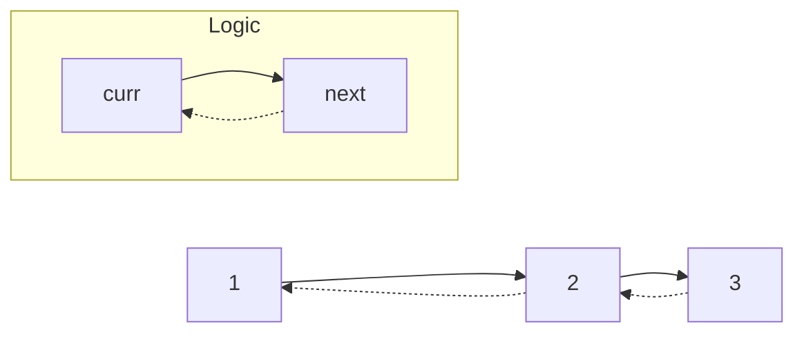

# Linked List

**Topic 6 of 18 | NeetCode 150 Interview Handbook**  
[← Back to Index](./index.md)

---

## Problems in this Section

| # | Problem | Difficulty |
|---|---------|------------|
| 35 | [Reverse Linked List](#35-reverse-linked-list) | 🟢 Easy |
| 36 | [Merge Two Sorted Lists](#36-merge-two-sorted-lists) | 🟢 Easy |
| 37 | [Reorder List](#37-reorder-list) | 🟡 Medium |
| 38 | [Remove Nth Node From End of List](#38-remove-nth-node-from-end-of-list) | 🟡 Medium |
| 39 | [Copy List With Random Pointer](#39-copy-list-with-random-pointer) | 🟡 Medium |
| 40 | [Add Two Numbers](#40-add-two-numbers) | 🟡 Medium |
| 41 | [Linked List Cycle](#41-linked-list-cycle) | 🟢 Easy |
| 42 | [Find the Duplicate Number](#42-find-the-duplicate-number) | 🟡 Medium |
| 43 | [LRU Cache](#43-lru-cache) | 🟡 Medium |
| 44 | [Merge K Sorted Lists](#44-merge-k-sorted-lists) | 🔴 Hard |
| 45 | [Reverse Nodes in K-Group](#45-reverse-nodes-in-k-group) | 🔴 Hard |

---

## 35. Reverse Linked List

**LeetCode #206 | Difficulty: 🟢 Easy**

### Problem Statement

Given the head of a singly linked list, reverse the list and return the new head.

```
Input:  1 → 2 → 3 → 4 → 5 → None
Output: 5 → 4 → 3 → 2 → 1 → None
```

### Intuition

Iteratively reverse pointer directions using three pointers: `prev`, `curr`, `next`. At each step, store `next`, flip `curr.next` to `prev`, then advance both pointers.



### Solution

```python
def reverseList(head):
    prev, curr = None, head
    while curr:
        next_node = curr.next
        curr.next = prev
        prev = curr
        curr = next_node
    return prev

# Recursive version
def reverseListRecursive(head):
    if not head or not head.next:
        return head
    new_head = reverseListRecursive(head.next)
    head.next.next = head
    head.next = None
    return new_head
```

**Time:** O(n) | **Space:** O(1) iterative, O(n) recursive

### Interview Traps

**Trap 1 — Losing the next pointer before saving it**
```python
# ❌ curr.next is overwritten before saving it
curr.next = prev
curr = curr.next  # now None!

# ✅ Always save next_node first
next_node = curr.next
curr.next = prev
curr = next_node
```

**Trap 2 — Returning curr instead of prev**
After the loop, `curr` is `None`. The new head is `prev`.

**Trap 3 — Recursive stack overflow**
For very long lists (e.g., 10^5 nodes), recursion hits Python's stack limit.  
✅ Default to the iterative approach; offer recursive as an alternative.

**Trap 4 — "Can you do it in-place?"**
The iterative approach is already in-place — O(1) extra space.

---

## 36. Merge Two Sorted Lists

**LeetCode #21 | Difficulty: 🟢 Easy**

### Problem Statement

Merge two sorted linked lists and return the head of the merged list. The list should be made by splicing together the nodes of the first two lists.

```
Input:  l1 = 1→2→4,  l2 = 1→3→4
Output: 1→1→2→3→4→4
```

### Intuition

Use a **dummy head** node to simplify edge cases. Maintain a `curr` pointer. At each step, compare the front nodes of both lists and attach the smaller one. When one list is exhausted, attach the remainder of the other.

### Solution

```python
def mergeTwoLists(l1, l2):
    dummy = ListNode(0)
    curr = dummy

    while l1 and l2:
        if l1.val <= l2.val:
            curr.next = l1
            l1 = l1.next
        else:
            curr.next = l2
            l2 = l2.next
        curr = curr.next

    curr.next = l1 or l2
    return dummy.next
```

**Time:** O(m + n) | **Space:** O(1)

### Interview Traps

**Trap 1 — Not using a dummy head**
Without a dummy node, you must handle the empty initial case with special-case code.  
✅ A dummy head simplifies the logic significantly — always use it.

**Trap 2 — Forgetting to attach the remaining list**
When one list runs out, the other still has nodes. `curr.next = l1 or l2` attaches whichever is non-null.

**Trap 3 — Creating new nodes**
The problem says "splice together" — reuse existing nodes. Don't allocate new `ListNode` objects.

**Trap 4 — Recursive version**
```python
def mergeTwoLists(l1, l2):
    if not l1: return l2
    if not l2: return l1
    if l1.val <= l2.val:
        l1.next = mergeTwoLists(l1.next, l2)
        return l1
    else:
        l2.next = mergeTwoLists(l1, l2.next)
        return l2
```
Elegant but O(m+n) stack space. Prefer iterative for large lists.

---

## 37. Reorder List

**LeetCode #143 | Difficulty: 🟡 Medium**

### Problem Statement

Given the head of a linked list `L0 → L1 → … → Ln`, reorder it to `L0 → Ln → L1 → Ln-1 → L2 → Ln-2 → …`. Do it in-place without altering node values.

```
Input:  1 → 2 → 3 → 4 → 5
Output: 1 → 5 → 2 → 4 → 3
```

### Intuition

Three steps:
1. **Find the middle** using slow/fast pointers.
2. **Reverse the second half** of the list.
3. **Merge** the two halves by alternating nodes.

### Solution

```python
def reorderList(head) -> None:
    # Step 1: Find middle
    slow, fast = head, head
    while fast and fast.next:
        slow = slow.next
        fast = fast.next.next

    # Step 2: Reverse second half
    prev, curr = None, slow.next
    slow.next = None  # cut the list
    while curr:
        nxt = curr.next
        curr.next = prev
        prev = curr
        curr = nxt
    second = prev

    # Step 3: Merge
    first = head
    while second:
        tmp1, tmp2 = first.next, second.next
        first.next = second
        second.next = tmp1
        first = tmp1
        second = tmp2
```

**Time:** O(n) | **Space:** O(1)

### Interview Traps

**Trap 1 — Not cutting the list after finding the middle**
If `slow.next` isn't set to `None`, the reversed second half still points into the first half — creating a cycle.  
✅ Always `slow.next = None` before reversing.

**Trap 2 — Saving tmp pointers before overwriting**
The merge step overwrites `first.next` and `second.next` — save both before modifying.

**Trap 3 — Off-by-one for even vs odd length**
For odd length (e.g., `1→2→3→4→5`), the middle is `3`. The second half starts at `4`. The middle node (`3`) stays in the first half. Verify with small examples.

**Trap 4 — "Can you do it with extra space?"**
Yes — store all nodes in a list and rebuild with two pointers from each end. O(n) space but simpler code. Offer this as the "simple" solution, then optimize to O(1).

---

## 38. Remove Nth Node From End of List

**LeetCode #19 | Difficulty: 🟡 Medium**

### Problem Statement

Given the head of a linked list, remove the nth node from the end and return the head.

```
Input:  head = 1→2→3→4→5, n = 2
Output: 1→2→3→5
```

### Intuition

Use two pointers: advance `fast` by `n` steps first, then move both `slow` and `fast` together until `fast` reaches the end. `slow` will then be just before the node to remove.

Use a **dummy head** so that removing the first node is handled uniformly.

### Solution

```python
def removeNthFromEnd(head, n: int):
    dummy = ListNode(0, head)
    fast = slow = dummy

    for _ in range(n + 1):
        fast = fast.next

    while fast:
        slow = slow.next
        fast = fast.next

    slow.next = slow.next.next
    return dummy.next
```

**Time:** O(L) one pass | **Space:** O(1)

### Interview Traps

**Trap 1 — Advancing fast by n instead of n+1**
Advancing by `n` places `slow` ON the node to delete, not before it. You need `slow` to be the predecessor.  
✅ Advance `fast` by `n+1` steps (starting from dummy).

**Trap 2 — Not using a dummy head**
Without a dummy, removing the first node (n == list length) requires a special case.  
✅ The dummy head makes all cases uniform.

**Trap 3 — Two-pass approach**
Counting length first and then removing on a second pass is valid but uses two passes.  
✅ The two-pointer technique solves it in one pass — mention this explicitly.

**Trap 4 — n larger than list length**
The problem guarantees `n` is valid. If it weren't, `fast` would go out of bounds — add a guard in production code.

---

## 39. Copy List With Random Pointer

**LeetCode #138 | Difficulty: 🟡 Medium**

### Problem Statement

A linked list has nodes with `val`, `next`, and `random` (pointing to any node or null). Return a **deep copy** of the list.

### Intuition

Use a **HashMap** mapping original nodes to their copies. Two passes:
1. Create all copy nodes (without setting `next`/`random`).
2. Set `next` and `random` for all copies using the map.

### Solution

```python
def copyRandomList(head):
    if not head:
        return None

    old_to_new = {None: None}

    # First pass: create all copies
    curr = head
    while curr:
        old_to_new[curr] = Node(curr.val)
        curr = curr.next

    # Second pass: wire up next and random
    curr = head
    while curr:
        old_to_new[curr].next   = old_to_new[curr.next]
        old_to_new[curr].random = old_to_new[curr.random]
        curr = curr.next

    return old_to_new[head]
```

**Time:** O(n) | **Space:** O(n)

### Interview Traps

**Trap 1 — Not mapping None → None**
`old_to_new[curr.random]` will fail if `random` is `None` and `None` isn't in the map.  
✅ Initialize with `{None: None}`.

**Trap 2 — O(1) space approach (interleaving)**
An advanced solution interleaves cloned nodes into the original list to avoid the HashMap. Know it exists but the HashMap approach is cleaner and preferred unless O(1) space is required.

**Trap 3 — Shallow copy vs deep copy**
Setting `copy.random = original.random` (instead of mapping through the dict) creates a shallow copy — the random pointer points to an original node, not a copy.  
✅ Always map through `old_to_new`.

**Trap 4 — Single node with self-referencing random**
`node.random = node` itself. The map handles this: `old_to_new[curr.random]` = `old_to_new[curr]` = the copy of curr. Correct.

---

## 40. Add Two Numbers

**LeetCode #2 | Difficulty: 🟡 Medium**

### Problem Statement

Two non-empty linked lists represent two non-negative integers stored in reverse order. Add the two numbers and return the sum as a linked list (also in reverse order).

```
Input:  l1 = 2→4→3 (represents 342), l2 = 5→6→4 (represents 465)
Output: 7→0→8  (represents 807)
```

### Intuition

Simulate grade-school addition digit by digit using a carry. Use a dummy head to collect result nodes. Continue while either list has nodes or carry is non-zero.

### Solution

```python
def addTwoNumbers(l1, l2):
    dummy = ListNode(0)
    curr = dummy
    carry = 0

    while l1 or l2 or carry:
        v1 = l1.val if l1 else 0
        v2 = l2.val if l2 else 0
        total = v1 + v2 + carry
        carry = total // 10
        curr.next = ListNode(total % 10)
        curr = curr.next
        l1 = l1.next if l1 else None
        l2 = l2.next if l2 else None

    return dummy.next
```

**Time:** O(max(m, n)) | **Space:** O(max(m, n))

### Interview Traps

**Trap 1 — Forgetting the final carry**
`999 + 1 = 1000` — the result has one more digit. The loop condition `or carry` handles this.

**Trap 2 — Unequal list lengths**
Use `v1 = l1.val if l1 else 0` — treat exhausted lists as contributing 0.

**Trap 3 — "What if numbers were stored in forward order?"**
That's LeetCode #445. Requires reversing lists first, or using a stack to process digits in reverse.

**Trap 4 — Modifying input lists**
The problem doesn't forbid it, but it's bad practice. Creating new nodes (as shown) is cleaner.

---

## 41. Linked List Cycle

**LeetCode #141 | Difficulty: 🟢 Easy**

### Problem Statement

Given the head of a linked list, determine if it has a cycle.

### Intuition

**Floyd's Cycle Detection** (tortoise and hare): Use slow (1 step) and fast (2 steps) pointers. If there's a cycle, they will eventually meet. If there's no cycle, fast reaches the end.

### Solution

```python
def hasCycle(head) -> bool:
    slow, fast = head, head
    while fast and fast.next:
        slow = slow.next
        fast = fast.next.next
        if slow == fast:
            return True
    return False
```

**Time:** O(n) | **Space:** O(1)

### Interview Traps

**Trap 1 — Using a HashSet**
Storing visited nodes in a set works but uses O(n) space.  
✅ Floyd's algorithm achieves O(1) space — always prefer it.

**Trap 2 — "Why does Floyd's algorithm always work?"**
In a cycle of length `k`, once both pointers are in the cycle, the gap between them closes by 1 each step → they meet within `k` steps.

**Trap 3 — "Where does the cycle start?" (LeetCode #142)**
Reset `slow` to `head` after detection. Advance both one step at a time — they meet at the cycle start. This is a beautiful mathematical property worth knowing.

**Trap 4 — Checking `slow == fast` before moving**
Both start at `head` so they're equal initially — check AFTER moving, not before.

---

## 42. Find the Duplicate Number

**LeetCode #287 | Difficulty: 🟡 Medium**

### Problem Statement

Given an array of `n+1` integers where each value is in `[1, n]`, find the one duplicate number. Must not modify the array and use only O(1) extra space.

```
Input:  nums = [1,3,4,2,2]
Output: 2
```

### Intuition

Treat the array as a linked list where `nums[i]` is a pointer to index `nums[i]`. Since one value is duplicated, two indices point to the same next index — creating a cycle. Use **Floyd's Cycle Detection** to find the cycle entry point (= the duplicate).

### Solution

```python
def findDuplicate(nums: list[int]) -> int:
    # Phase 1: Find the intersection point
    slow, fast = nums[0], nums[nums[0]]
    while slow != fast:
        slow = nums[slow]
        fast = nums[nums[fast]]

    # Phase 2: Find the cycle entry (duplicate)
    slow = 0
    while slow != fast:
        slow = nums[slow]
        fast = nums[fast]

    return slow
```

**Time:** O(n) | **Space:** O(1)

### Interview Traps

**Trap 1 — Sorting the array**
Sorting modifies the array, which is forbidden.

**Trap 2 — Using a HashSet**
Correct but uses O(n) space — also forbidden by the constraints.

**Trap 3 — "Why does this work like a linked list cycle?"**
Since values are in `[1, n]` and the array has `n+1` elements, every index points to another valid index. The duplicate value means two indices point to the same place → cycle.

**Trap 4 — Phase 2 starting position**
Reset one pointer to index `0` (not `nums[0]`). Both move one step at a time. They meet at the duplicate.

**Trap 5 — Not distinguishing from Linked List Cycle Detection**
The same algorithm applies but the "nodes" are array indices, not actual ListNodes. Explain this mapping clearly.

---

## 43. LRU Cache

**LeetCode #146 | Difficulty: 🟡 Medium**

### Problem Statement

Design a data structure that follows the **Least Recently Used (LRU)** cache eviction policy. Implement `get(key)` and `put(key, value)` both in O(1) time. The cache has a fixed capacity.

### Intuition

Combine a **HashMap** (O(1) key lookup) with a **doubly linked list** (O(1) insertion/removal to maintain order). The list maintains recency: most recently used at the tail, least recently used at the head.

On `get`: move the accessed node to the tail.  
On `put`: insert at the tail. If over capacity, remove the head node (LRU).

### Solution

```python
class Node:
    def __init__(self, key=0, val=0):
        self.key = key
        self.val = val
        self.prev = self.next = None

class LRUCache:
    def __init__(self, capacity: int):
        self.cap = capacity
        self.cache = {}  # key -> Node
        # Sentinel nodes
        self.head = Node()  # LRU end
        self.tail = Node()  # MRU end
        self.head.next = self.tail
        self.tail.prev = self.head

    def _remove(self, node):
        node.prev.next = node.next
        node.next.prev = node.prev

    def _insert_tail(self, node):
        node.prev = self.tail.prev
        node.next = self.tail
        self.tail.prev.next = node
        self.tail.prev = node

    def get(self, key: int) -> int:
        if key not in self.cache:
            return -1
        node = self.cache[key]
        self._remove(node)
        self._insert_tail(node)
        return node.val

    def put(self, key: int, value: int) -> None:
        if key in self.cache:
            self._remove(self.cache[key])
        node = Node(key, value)
        self.cache[key] = node
        self._insert_tail(node)
        if len(self.cache) > self.cap:
            lru = self.head.next
            self._remove(lru)
            del self.cache[lru.key]
```

**Time:** O(1) all operations | **Space:** O(capacity)

### Interview Traps

**Trap 1 — Using Python's OrderedDict**
`OrderedDict` gives a clean one-liner solution — but the interviewer almost always wants you to implement the doubly linked list manually.
```python
from collections import OrderedDict
# Acceptable only if interviewer explicitly allows it
```

**Trap 2 — Not storing the key in the Node**
When evicting the LRU node, you need to delete it from the HashMap too. Without the key stored in the node, you can't find it in O(1).  
✅ Always store `key` in the Node.

**Trap 3 — Forgetting sentinel nodes**
Without sentinel head/tail, insert and remove operations require many null checks.  
✅ Sentinel nodes make `_remove` and `_insert_tail` uniformly simple.

**Trap 4 — Updating existing key in put**
If the key already exists, remove the old node before inserting the new one.

**Trap 5 — Evicting before checking capacity**
Evict only when `len(cache) > capacity` — after the new node is inserted.

---

## 44. Merge K Sorted Lists

**LeetCode #23 | Difficulty: 🔴 Hard**

### Problem Statement

Given an array of `k` linked lists, each sorted in ascending order, merge them into one sorted linked list.

```
Input:  lists = [1→4→5, 1→3→4, 2→6]
Output: 1→1→2→3→4→4→5→6
```

### Intuition

Use a **min-heap** of size k. Initialize it with the head of each list. Repeatedly pop the minimum, attach it to the result, and push the next node from that list.

Alternative: **divide and conquer** — merge lists pairwise, halving the number of lists each round. O(n log k) either way, but the heap approach has lower constant.

### Solution

```python
import heapq

def mergeKLists(lists):
    dummy = ListNode(0)
    curr = dummy
    heap = []

    for i, node in enumerate(lists):
        if node:
            heapq.heappush(heap, (node.val, i, node))

    while heap:
        val, i, node = heapq.heappop(heap)
        curr.next = node
        curr = curr.next
        if node.next:
            heapq.heappush(heap, (node.next.val, i, node.next))

    return dummy.next
```

**Time:** O(n log k) where n = total nodes | **Space:** O(k)

### Interview Traps

**Trap 1 — Naively merging one by one**
Merging lists sequentially is O(nk) — not O(n log k).  
✅ The heap (or divide-and-conquer) achieves O(n log k).

**Trap 2 — Heap comparison on ListNode objects**
Python's heapq compares tuples element by element. If two nodes have equal values, it tries to compare `ListNode` objects → TypeError.  
✅ Use `(val, i, node)` where `i` is a unique list index as a tiebreaker.

**Trap 3 — Not handling None lists**
Skip null list heads when initializing the heap.

**Trap 4 — Divide and conquer alternative**
```python
# Divide and conquer — also O(n log k)
while len(lists) > 1:
    merged = []
    for i in range(0, len(lists), 2):
        l1 = lists[i]
        l2 = lists[i+1] if i+1 < len(lists) else None
        merged.append(mergeTwoLists(l1, l2))
    lists = merged
return lists[0]
```

---

## 45. Reverse Nodes in K-Group

**LeetCode #25 | Difficulty: 🔴 Hard**

### Problem Statement

Given the head of a linked list, reverse the nodes of the list `k` at a time. If the number of nodes is not a multiple of `k`, leave the remaining nodes as-is.

```
Input:  head = 1→2→3→4→5, k = 2
Output: 2→1→4→3→5

Input:  head = 1→2→3→4→5, k = 3
Output: 3→2→1→4→5
```

### Intuition

For each group of `k` nodes:
1. Check if `k` nodes exist (if not, leave as-is).
2. Reverse the `k` nodes.
3. Connect the reversed group to the previous part and recurse/continue for the next group.

Use a dummy head and track the `group_prev` (tail of the already-processed portion).

### Solution

```python
def reverseKGroup(head, k: int):
    dummy = ListNode(0, head)
    group_prev = dummy

    while True:
        # Check if k nodes remain
        kth = get_kth(group_prev, k)
        if not kth:
            break

        group_next = kth.next
        # Reverse the group
        prev, curr = group_next, group_prev.next
        while curr != group_next:
            nxt = curr.next
            curr.next = prev
            prev = curr
            curr = nxt

        # Connect with previous part
        tmp = group_prev.next       # old first = new last of group
        group_prev.next = kth       # old kth = new first of group
        group_prev = tmp

    return dummy.next

def get_kth(curr, k):
    while curr and k > 0:
        curr = curr.next
        k -= 1
    return curr
```

**Time:** O(n) | **Space:** O(1)

### Interview Traps

**Trap 1 — Not checking if k nodes remain**
If fewer than k nodes remain, they must stay in their original order. Always verify with `get_kth` before reversing.

**Trap 2 — Losing the connection to the next group**
Save `group_next = kth.next` before reversing, as the reversal will overwrite pointers.

**Trap 3 — Updating group_prev incorrectly**
After reversing, `group_prev` should point to the last node of the reversed group (which was the first before reversing). Save `tmp = group_prev.next` before overwriting `group_prev.next`.

**Trap 4 — Recursive solution**
```python
def reverseKGroup(head, k):
    curr, count = head, 0
    while curr and count < k:
        curr = curr.next
        count += 1
    if count < k:
        return head
    prev, curr = None, head
    for _ in range(k):
        nxt = curr.next
        curr.next = prev
        prev = curr
        curr = nxt
    head.next = reverseKGroup(curr, k)
    return prev
```
Elegant but O(n/k) stack depth. For large inputs, prefer iterative.

**Trap 5 — k = 1 edge case**
Reversing groups of 1 should return the original list. The algorithm handles this correctly — each "group" is reversed in place (no change).

---

*[← Back to Index](./index.md) | [Next: Trees →](./07_trees.md)*
